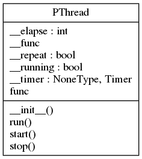

# pthread
## Description:

This package provide a simple way to manage multithreading in python project.

## Why:
- Clean the main code
- Simplify multithreading use with general objectives

## Why we will never use it:
- :x: All the code use multithreading
- :x: We use complex mecanisme between object: sync between object or data issue

## Setup:
```shell
git clone https://github.com/francois-le-ko4la/python-multithreading.git
cd python-multithreading
make install
```

## Test:
```shell
make test
```

## Use:

Take a look in the dev part.

## Project Structure
```
.
├── last_check.log
├── LICENSE
├── Makefile
├── pictures
│   ├── classes_pythread.png
│   └── packages_pythread.png
├── pythread
│   ├── __about__.py
│   ├── __init__.py
│   └── thread.py
├── README.md
├── runtime.txt
├── setup.cfg
├── setup.py
└── tests
    ├── test_doctest.py
    └── test_pycodestyle.py

```

## Todo:

- [X] Create the project
- [X] Write code and tests
- [X] Test installation and requirements (setup.py and/or Makefile)
- [X] Test code
- [X] Validate features
- [X] Write Doc/stringdoc
- [X] Run PEP8 validation
- [X] Clean & last check
- [X] Release
- [X] change (un)install process
- [X] remove MANIFEST.in
- [X] manage global var: __version__....
- [X] improve the doc
- [X] Release : 0.1.1
- [X] improve Makefile
- [X] Release : 0.1.2
- [X] validate (un)install process
- [X] rename module : pthread => pythread
- [X] Release : 1.0.0
- [X] fix setup
- [X] improve docstring
- [X] update doc
- [X] Release : 1.1.0

## License

This package is distributed under the [GPLv3 license](./LICENSE)
### Runtime

```

python-3.6.x


```

### UML Diagram



### Objects

[PThread()](#pthread)<br />
[@Property PThread.func](#property-pthreadfunc)<br />
[PThread.start()](#pthreadstart)<br />
[PThread.run()](#pthreadrun)<br />
[PThread.stop()](#pthreadstop)<br />


#### PThread()
```python
class PThread(Thread):
```

```
A class that represents a thread of control.
This class subclassed Thread class :
    class Thread(builtins.object)

We specify the activity by passing a callable object to the constructor.

Why:
    - clean the main code
    - dedicate import Thread
    - simplify multithreading use with generic objectives

Why we will neve use it:
    - all the code use multithreading
    - we use complex mecanisme between object: sync between object or
      data issue

    +----------+
    |          |   define with func & elapse
  -->   INIT   +-------------------+----------------------+
    |          |                   |                      |
    +----------+                   |                      |
                                   |                      |
         +----------------------------------------------+ |
         |                         |                    | |
         |               +-----------------------------------------+
         |               | RUN     |                    | |        |
    +----v-----+         |    +----v-----+          +---+-v---+    |
    |          |         |    |          |          |         |    |
  -->  START   +-------------->   TASK   +---------->  TIMER  |    |
    |          |         |    |          |          |         |    |
    +----------+         |    +----^-----+          +----^----+    |
                         |         |                     |         |
                         +-----------------------------------------+
                                   |                     |
    +----------+     disable       |                     |
    |          +-------------------+         cancel      |
  -->   STOP   +-----------------------------------------+
    |          +--------------------+
    +----------+                    |
                              +-----v-----+
                              |           |
                              |JOIN Thread|
                              |           |
                              +-----------+

Use:
    >>> # Import the module :
    >>> from pythread import PThread
    >>> import time
    >>> # define a task
    >>> def mytask(): print("lorem ipsum dolor sit amet consectetur")
    >>> # We want to run "mytask" in a thread and repeat the task:
    >>> mthr = PThread(mytask, 0.1)
    >>> mthr.start() ; print("other task");time.sleep(0.3) ; mthr.stop()
    lorem ipsum dolor sit amet consectetur
    other task
    lorem ipsum dolor sit amet consectetur
    lorem ipsum dolor sit amet consectetur
    >>> # We want to run "mytask" in a thread one time:
    >>> mthr = PThread(mytask).start() ; print("other task")
    lorem ipsum dolor sit amet consectetur
    other task
    >>> # oups - start issue:
    >>> mthr = PThread(mytask, 0.1)
    >>> mthr.start() ; mthr.start()
    Traceback (most recent call last):
    ...
    RuntimeError: threads can only be started once
    >>> # Stop a not repeatable task:
    >>> mthr = PThread(mytask)
    >>> mthr.start() ; print("other task")
    lorem ipsum dolor sit amet consectetur
    other task
    >>> mthr.stop()
    >>> # a test avoid the AttributeError exception
```

##### @Property PThread.func
```python
@property
def PThread.func(self):
```
> <br />
> Returns the callable object defined by Thread constructor.<br />
> <br />
> <b>Args:</b><br />
> &nbsp;&nbsp;&nbsp;&nbsp;&nbsp;&nbsp;&nbsp;&nbsp;&nbsp;&nbsp;&nbsp;&nbsp;&nbsp;&nbsp;&nbsp;  None.<br />
> <br />
> <b>Returns:</b><br />
> &nbsp;&nbsp;&nbsp;&nbsp;&nbsp;&nbsp;&nbsp;&nbsp;&nbsp;&nbsp;&nbsp;&nbsp;&nbsp;&nbsp;&nbsp;  callable object<br />
> <br />
##### PThread.start()
```python

def PThread.start(self):
```
> <br />
> Start the thread's activity.<br />
> <br />
> It must be called at most once per thread object. It arranges for the<br />
> object's run() method to be invoked in a separate thread of control.<br />
> <br />
> This method will raise a RuntimeError if called more than once on the<br />
> same thread object.<br />
> <br />
> <b>Args:</b><br />
> &nbsp;&nbsp;&nbsp;&nbsp;&nbsp;&nbsp;&nbsp;&nbsp;&nbsp;&nbsp;&nbsp;&nbsp;&nbsp;&nbsp;&nbsp;  None.<br />
> <br />
> <b>Return:</b><br />
> &nbsp;&nbsp;&nbsp;&nbsp;&nbsp;&nbsp;&nbsp;&nbsp;&nbsp;&nbsp;&nbsp;&nbsp;&nbsp;&nbsp;&nbsp;  None.<br />
> <br />
##### PThread.run()
```python

def PThread.run(self):
```
> <br />
> Method (override) representing the thread's activity.<br />
> This method will raise a RuntimeError if called more than once on the<br />
> same thread object.<br />
> <br />
> <b>Args:</b><br />
> &nbsp;&nbsp;&nbsp;&nbsp;&nbsp;&nbsp;&nbsp;&nbsp;&nbsp;&nbsp;&nbsp;&nbsp;&nbsp;&nbsp;&nbsp;  None.<br />
> <br />
> <b>Returns:</b><br />
> &nbsp;&nbsp;&nbsp;&nbsp;&nbsp;&nbsp;&nbsp;&nbsp;&nbsp;&nbsp;&nbsp;&nbsp;&nbsp;&nbsp;&nbsp;  None.<br />
> <br />
##### PThread.stop()
```python

def PThread.stop(self):
```
> <br />
> Wait until the thread terminates.<br />
> This blocks the calling thread until the thread whose join() method is<br />
> called terminates -- either normally or through an unhandled exception.<br />
> <br />
> <b>Args:</b><br />
> &nbsp;&nbsp;&nbsp;&nbsp;&nbsp;&nbsp;&nbsp;&nbsp;&nbsp;&nbsp;&nbsp;&nbsp;&nbsp;&nbsp;&nbsp;  None.<br />
> <br />
> <b>Returns:</b><br />
> &nbsp;&nbsp;&nbsp;&nbsp;&nbsp;&nbsp;&nbsp;&nbsp;&nbsp;&nbsp;&nbsp;&nbsp;&nbsp;&nbsp;&nbsp;  None.<br />
> <br />
